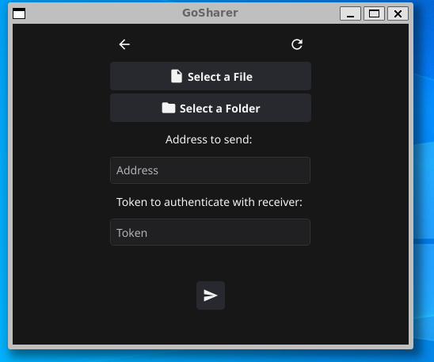

# GoSharer 
## Very small desktop app to share files and folders with everyone u want without a middle man.

* ### Use the benefits of using GRPC as transport. 
* ### All data travels encrypted direct to the receiver. 
* ### Max 50 GB per request.
---
### Will need a GCC -> [Pre Requisites](https://docs.fyne.io/started/)
### 
### To allow you recieve outside request will need port-forwading your router.
---
* Select what need to do.

* To share just need address & token.  

* To receive just need select a drop location, the token is auto generate but can use your own custom token too.
* By default the max size of incoming request is set to 20MB. Can be modified with a number in MB or GB.

---
